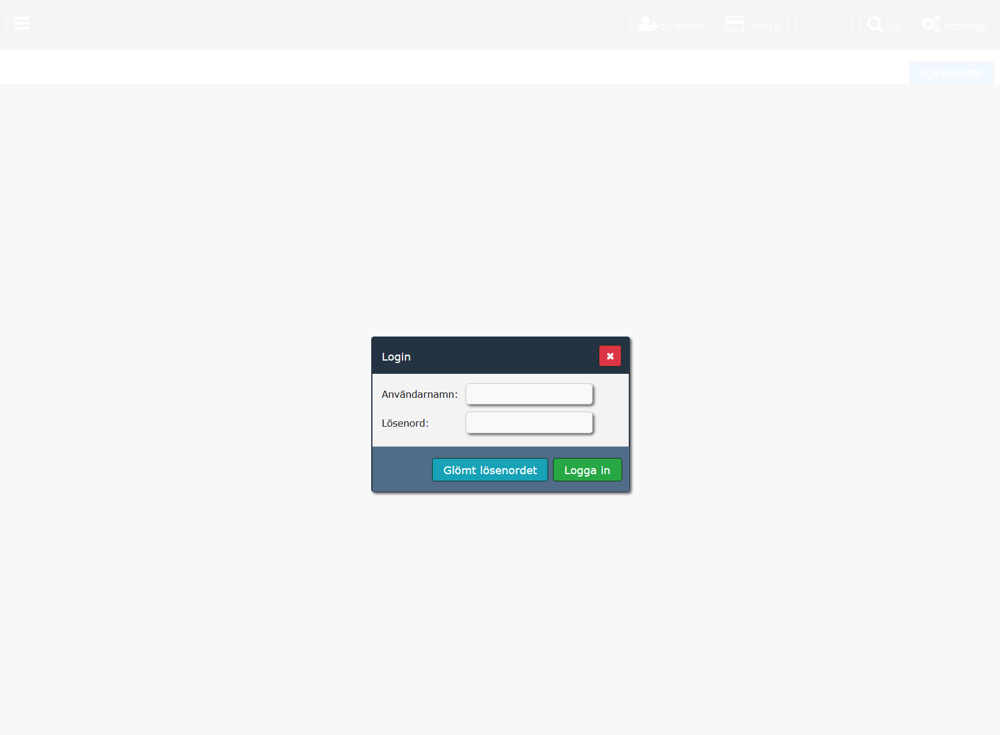
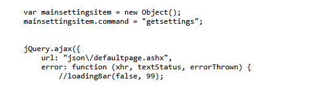
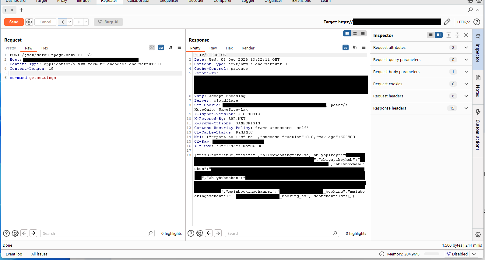

It started as a way to kill time during my internship and ended with a panic, a rogue SQL server, and a deeper understanding of responsible disclosure.


By week four of my internship at an MSP, I’d burned through my task list. I needed a new target while waiting for the next project assignment - something low stakes to keep my brain engaged. That’s when I opened the app for the gym chain I go to, to analyze traffic, because why not.


While analyzing the traffic, I stumbled upon a specific backend server: `local-gym.saas-services.com`. What immediately caught my eye was how incredibly legacy it looked compared to their modern main site. It felt like a relic they had forgotten to decommission, which usually means one thing: older code and unpatched vulnerabilities.



That "gut feeling" about the legacy interface is what kicked off this entire chain of events.


## Part 1: The Keys to the Kingdom


I started by mapping out the API endpoints associated with this legacy subdomain by digging through the very old JS. Lots of JQuery and blobs of non-obfuscated and formatted Javascript. It didn't take long to find a function constructing a request to `json/defaultpage.ashx` with the command `getsettings`.



I sent the request via Burp Repeater without any session cookies to see what I'd get.





**The Response:**

```json

{
  "resultat": true,
  "ablyapikey": "ROOT_KEY_HERE",
  "ablybowheadtoken": "...",
  "doorchannels": []
  ...
}
```


It returned a full **Ably API Key** with **Root Scope**.


To verify the severity without disrupting operations, I first attempted to publish a "ping" message to a completely non-existent, isolated channel (test_channel_aldin). If the system was secure, this would fail. It didn't. The message went through, confirming I had Write Access.

With that confirmed, I subscribed to the [meta] channel to check the scope. My console immediately flooded with real-time events from hundreds of gyms across Sweden. It wasn't a dead key. It wasn't a key only for this specific gym. It wasn't even read only. I had write-access and visibility into the entire SaaS platform's nervous system.

## The Disclosure & Permission


At this point, I stopped testing immediately.


I wrote up a report detailing the Ably Root Key leak and sent it to my contact, the CTO. I explained the severity: total lack of tenant isolation.


He responded quickly. They rotated the keys immediately. Crucially, in our email exchange, he acknowledged my skills and gave me **explicit written permission** to continue probing their infrastructure to see if there were deeper issues.


## Part 2: The Rogue Database Pointer


With the green light to proceed, I returned to the domain with a more aggressive mindset.


I ran a directory fuzz using `ffuf` and a standard wordlist. I quickly found a hit: `/setup/`.


Unlike the legacy main site, this endpoint served a modern Bootstrap interface. It was an unauthenticated installation wizard. Because the domain used a wildcard certificate, I could access this wizard on any random subdomain I invented (e.g., `temp-test.saas-services.com/setup/`).


The wizard allowed me to configure the site's **Hostname** and, crucially, the **Database Connection**.


### The Exploit: Hijacking the Connection


The setup form didn't verify if the database was local or trusted. It just accepted whatever IP address I gave it.


1.  I spun up a VPS and ran a Python script acting as a "Rogue SQL Server."

2.  I entered my VPS IP into the gym provider's setup form and clicked "Save."

3.  The SaaS platform immediately tried to authenticate with my rogue server.


**The Impact:**

My Python script captured the incoming connection. I successfully grabbed the **MSSQL username and password hash** that the platform used to connect to its production databases.


To verify this wasn't just a fluke, I later set up a legitimate MSSQL server on my VPS and let the platform connect. It began running its initialization script, creating tables and populating a schema on *my* server. I could view the entire database structure, including other hardcoded API keys (which were thankfully dead/inactive).


## Conclusion


This engagement highlighted two important lessons:


1.  **Legacy Subdomains are Goldmines:** That initial hunch about the "old-looking" server led to the highest severity findings.

2.  **Communication is Key:** Stopping after the first finding and establishing clear rules of engagement with the CTO turned a standard bug report into a deeper, sanctioned security audit.


The company patched the `/setup/` endpoint by adding authentication and scrubbing the legacy API keys. They even sent me a gift card as a thank you - proof that ethical hacking pays off.
